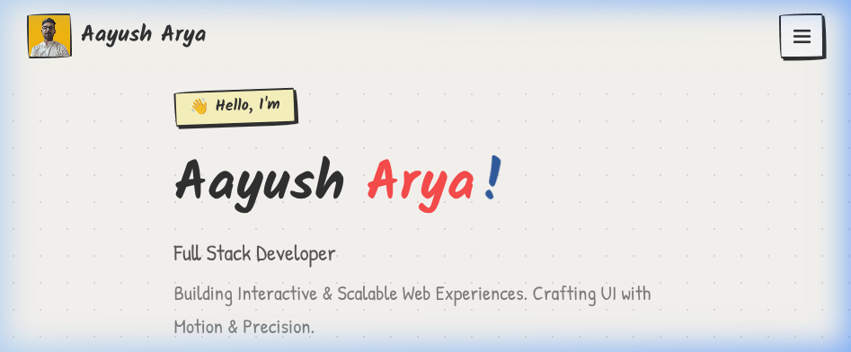
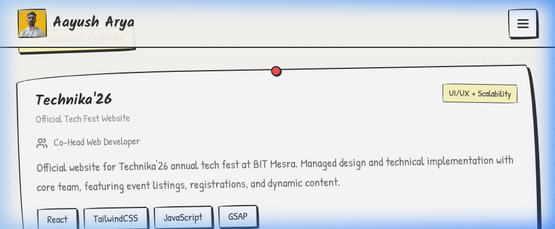

# 🧑‍💻 Aayush Arya — Portfolio Website

A playfully designed, hand-drawn/sketchy themed personal portfolio showcasing my **projects**, **skills**, and **experience** as a Full Stack Developer. The entire design system is built with React, Tailwind CSS, and Framer Motion to create engaging, dynamic interactions.

---

## 🌐 Live Website

👉 [Visit Portfolio Site](https://portfolio-main-aayusharya.vercel.app/)  
👉 [GitHub Profile](https://github.com/AayushArya28)  
👉 [LinkedIn](https://www.linkedin.com/in/aayusharyaiam/)  
👉 [LeetCode](https://leetcode.com/u/aayusharya_i_am/)

---

## 🎨 Design System: Sketchy & Hand-Drawn

The website features a unique "paper and pencil" aesthetic:
- **Warm Paper Textures:** Utilizing a dot grid `#fdfbf7` backdrop.
- **Wobbly Borders & Hard Shadows:** Custom CSS shapes overriding standard Tailwind radii.
- **Handwritten Typography:** Utilizing `Kalam` and `Patrick Hand` Google fonts.
- **Decorative SVGs:** Sticky labels, Post-it notes, tape strips, and speech bubbles.

### Visual Preview

<br>
<div align="center">
  
  <p><em>Hero Section with SVG Sketch Animations and Parallax Context</em></p>
</div>
<br>
<div align="center">
  
  <p><em>Wobbly Project Cards and Rotated Decorative Callouts</em></p>
</div>
<br>

---

## 🚀 Key Features

- ⚡ **Interactive UI:** Powered by React + Vite.
- 🎬 **Animations:** Path drawing, parallax layers, and scroll-triggers implemented with `framer-motion`.
- 📱 **Responsive Design:** Fluidly adapts from mobile viewports to ultra-wide displays.
- 📥 **Resume Integration:** Immediate downloadable PDF of latest experiences.
- 📬 **Serverless Contact Form:** End-to-end mailing hooked into `formsubmit.co` without complex backend requirements.

---

## 🧩 Sections Included

- **Home** – Dynamic hero with "drawing" animations and a quick career pitch.
- **About Me** – Education timeline and statistics on Post-it widgets.
- **Projects** – Comprehensive highlight spanning Web/Full Stack applications:
  - *Technika'26* (Official Tech Fest Website)
  - *Prakrida'26* & *IEEE Student Branch* Portals
  - *Bharti AI* (Gen AI text, code, audio synthesis platform)
  - *Lifeer* & *IMPACT'25*
- **Skills** – Stack breakdown (Go, MongoDB, MySQL, C++, React) and earned Certifications.
- **Experience** – Outlining leadership execution as *Co-Head Web Developer* in several institutions.
- **Contact** – Reachable interactive forms and social media.

---

## 🛠️ Stack & Dependencies

- **Framework:** `React 18` and `Vite`
- **Styling:** `Tailwind CSS 3` (Custom configuration for "wobbly" organic shapes)
- **Icons & Graphics:** `lucide-react`
- **Animations:** `framer-motion` (for scroll-triggers, bounce effects, and `pathLength` SVG manipulation).

---

## 🧰 How to Run Locally

```bash
# Clone the repository
git clone https://github.com/AayushArya28/portfolio-website.git
cd portfolio-website

# Install frontend dependencies
npm install

# Start the Vite development server
npm run dev

# Build for production
npm run build
```
